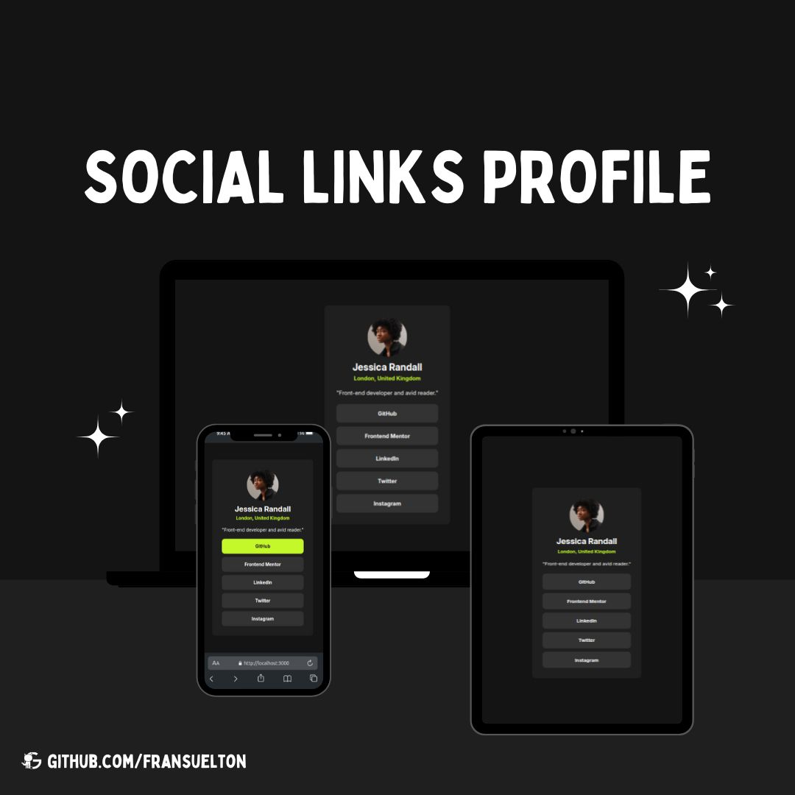

# Frontend Mentor - Social links profile solution

This is a solution to the [Social links profile challenge on Frontend Mentor](https://www.frontendmentor.io/challenges/social-links-profile-UG32l9m6dQ). Frontend Mentor challenges help you improve your coding skills by building realistic projects.

## The challenge

Users should be able to:

- See hover and focus states for all interactive elements on the page

## Screenshot

## Links

- Solution URL: [Frontend Mentor](https://www.frontendmentor.io/solutions/social-links-profile-with-html-and-css-vvj7E9_gKm)
- Live Site URL: [GitHub Pages](https://fransuelton.github.io/social-links-profile/)

## Built with

- Semantic HTML5 markup
- CSS custom properties
- Flexbox
- Mobile-first workflow

## Author

- Linktree - [Fransuelton.dev](https://fransuelton.dev/links/)
- Frontend Mentor - [@Fransuelton](https://www.frontendmentor.io/profile/Fransuelton)
